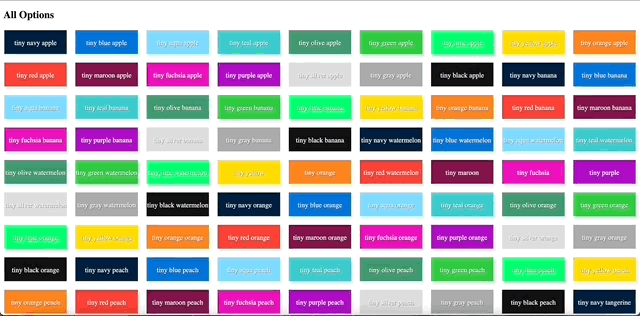

# Close Senior or Staff Frontend Engineer - React (100% Remote) Test

LIVE PREVIEW - https://close-test.netlify.app

Requirements
Implement a feature to allow item selection with the following requirements:

1. Clicking an item selects/unselects it.
2. Multiple items can be selected at a time.
3. Make sure to avoid unnecessary re-renders of each list item in the big list (performance).
4. Currently selected items should be visually highlighted.
5. Currently selected items' names should be shown at the top of the page.

